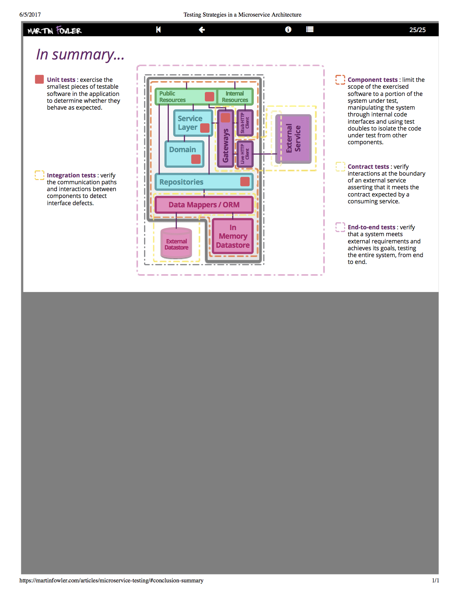

# Contract By Example

祁兮

from ThoughtWorks


## The problem


### Seperating frontend and backend

<table>
<tr>
<td width="500px">
<pre>
```
┌−−−−−−−−−−−−−−−┐
╎ Frontend      ╎
╎               ╎
╎ ┌───────────┐ ╎
╎ │ AngularJS │ ╎
╎ └───────────┘ ╎
╎ ┌───────────┐ ╎
╎ │    CSS    │ ╎
╎ └───────────┘ ╎
╎ ┌───────────┐ ╎
╎ │   HTML5   │ ╎
╎ └───────────┘ ╎
╎ ┌───────────┐ ╎
╎ │  Node.js  │ ╎
╎ └───────────┘ ╎
╎ ┌───────────┐ ╎
╎ │   React   │ ╎
╎ └───────────┘ ╎
╎ ┌───────────┐ ╎
╎ │  Vue.js   │ ╎
╎ └───────────┘ ╎
╎ ┌───────────┐ ╎
╎ │  Webpack  │ ╎
╎ └───────────┘ ╎
╎               ╎
└−−−−−−−−−−−−−−−┘
```
</pre>
</td>
<td width="500px">
<pre>
```
┌−−−−−−−−−−−−−−−−−−−−−┐
╎ Backend             ╎
╎                     ╎
╎ ┌─────────────────┐ ╎
╎ │     Flyway      │ ╎
╎ └─────────────────┘ ╎
╎ ┌─────────────────┐ ╎
╎ │     Gradle      │ ╎
╎ └─────────────────┘ ╎
╎ ┌─────────────────┐ ╎
╎ │      Maven      │ ╎
╎ └─────────────────┘ ╎
╎ ┌─────────────────┐ ╎
╎ │      MySQL      │ ╎
╎ └─────────────────┘ ╎
╎ ┌─────────────────┐ ╎
╎ │   Spring Boot   │ ╎
╎ └─────────────────┘ ╎
╎ ┌─────────────────┐ ╎
╎ │   Spring MVC    │ ╎
╎ └─────────────────┘ ╎
╎ ┌─────────────────┐ ╎
╎ │ Spring Security │ ╎
╎ └─────────────────┘ ╎
╎                     ╎
└−−−−−−−−−−−−−−−−−−−−−┘
```
</pre>
</td>
</tr>
</table>


```
┌──────────────────────┐  Ajax   ┌────────────────────────┐
│ Browser ( Frontend ) │ ──────> │ RESTful APIs (Backend) │
└──────────────────────┘         └────────────────────────┘
```


### Collaboration


#### 1. Contracts

```
┌──────────┐      ┌───────────┐      ┌─────────┐
│ Frontend │ <──> │ Contracts │ <──> │ Backend │
└──────────┘      └───────────┘      └─────────┘
```


#### 2. Mock server for frontend

```
                ┌−−−−−−−−−−−−−−−┐
                ╎ Mock Server   ╎
                ╎               ╎
┌─────┐  HTTP   ╎ ┌───────────┐ ╎
│ Web │ ──────> ╎ │ Contract  │ ╎
└─────┘         ╎ └───────────┘ ╎
                ╎               ╎
                └−−−−−−−−−−−−−−−┘
```


#### 3. Verify backend

```
┌−−−−−−−−−−−−−−┐
╎ Test         ╎
╎              ╎
╎ ┌──────────┐ ╎  HTTP   ┌─────────────┐
╎ │ Contract │ ╎ ──────> │ RESTful API │
╎ └──────────┘ ╎         └─────────────┘
╎              ╎
└−−−−−−−−−−−−−−┘
```


#### 4. Evolution Support


## Consumer-Driven Contracts
### A Service Evolution Pattern


### pact


#### 1. Contracts

```ruby
    before do
      animal_service.given("an alligator exists").
        upon_receiving("a request for an alligator").
        with(method: :get, path: '/alligator', query: '').
        will_respond_with(
          status: 200,
          headers: {'Content-Type' => 'application/json'},
          body: {name: 'Betty'} )
    end
```


### 2. Mock server for frontend
### 3. Verify backend
### 4. Evolution Support


```
┌──────────┐     ┌───────────┐     ┌─────────┐
│ Frontend │ ──> │ Contracts │ ··> │ Backend │
└──────────┘     └───────────┘     └─────────┘

```


### BFF - Backend for frontends

```
┌─────┐  contracts   ┌─────┐  contracts   ┌──────────────┐
│ Web │ ───────────> │ BFF │ ───────────> │ RESTful APIs │
└─────┘              └─────┘              └──────────────┘
```


## Provider Contracts


### RAML

```yaml
/songs:
  description: Collection of available songs in Jukebox
  get:
    description: Get a list of songs based on the song title.
    queryParameters:
      songTitle:
        description: "The title of the song to search (it is case insensitive and doesn't need to match the whole title)"
        required: true
        minLength: 3
        type: string
        example: "Get L"
    responses:
      200:
        body:
          application/json:
            example: |
                [
                  {
                    "songId": "550e8400-e29b-41d4-a716-446655440000",
                    "songTitle": "Get Lucky"
                  },
                  {
                    "songId": "550e8400-e29b-41d4-a716-446655440111",
                    "songTitle": "Loose yourself to dance"
                  },
                  {
                    "songId": "550e8400-e29b-41d4-a716-446655440222",
                    "songTitle": "Gio sorgio by Moroder"
                  }
                ]
```


## Specification By Example


```sql
SELECT
    [ALL | DISTINCT | DISTINCTROW ]
      [HIGH_PRIORITY]
      [MAX_STATEMENT_TIME = N]
      [STRAIGHT_JOIN]
      [SQL_SMALL_RESULT] [SQL_BIG_RESULT] [SQL_BUFFER_RESULT]
      [SQL_CACHE | SQL_NO_CACHE] [SQL_CALC_FOUND_ROWS]
    select_expr [, select_expr ...]
    [FROM table_references
      [PARTITION partition_list]
    [WHERE where_condition]
    [GROUP BY {col_name | expr | position}
      [ASC | DESC], ... [WITH ROLLUP]]
    [HAVING where_condition]
    [ORDER BY {col_name | expr | position}
      [ASC | DESC], ...]
    [LIMIT {[offset,] row_count | row_count OFFSET offset}]
    [PROCEDURE procedure_name(argument_list)]
    [INTO OUTFILE 'file_name'
        [CHARACTER SET charset_name]
        export_options
      | INTO DUMPFILE 'file_name'
      | INTO var_name [, var_name]]
    [FOR UPDATE | LOCK IN SHARE MODE]]
```


```sql
SELECT 1 + 1;
```


One of the great things about specification by example is that examples are usually much easier to come up with, particularly for the non-nerds who we write the software for.

-- Martin Fowler


## Contract By Example


### 1. Contracts

```json
{
    "description": "anonymous_can_get_alligator",
    "request": {
        "method": "GET",
        "uri": "/alligator"
    },
    "response": {
        "status": 200,
        "headers": {
            "content-type": "application/json"
        },
        "json": {
            "name": "Betty"
        }
    }
}
```


### 2. Mock server for frontend

<https://github.com/dreamhead/moco>


```sh
./moco http -p 12306 -g api.json
```


### 3. Verify backend

<https://github.com/macdao/moscow>

```java
public class AlligatorApiTest extends ApiTestBase {
    @Test
    public void anonymous_can_get_alligator() throws Exception {
        assertContract();
    }
}
```


### 4. Evolution Support


## Moscow


### `ApiTestBase`

```java
@RunWith(SpringJUnit4ClassRunner.class)
@SpringApplicationConfiguration(classes = Application.class)
@WebIntegrationTest("server.port:0")
public abstract class ApiTestBase {
    private static final ContractContainer container = new ContractContainer(Paths.get("src/test/resources/contracts"));
    @Rule
    public final TestName name = new TestName();
    @Value("${local.server.port}")
    protected int port;

    protected Map<String, String> assertContract() {
        return assertContract(name.getMethodName());
    }

    protected Map<String, String> assertContract(String description) {
        return new ContractAssertion(container.findContracts(description))
                .setPort(port)
                .setExecutionTimeout(200)
                .assertContract();
    }
}
```


### cleaning

```java
    @Autowired
    private Flyway flyway;

    @Before
    public void setUp() throws Exception {
        flyway.clean();
        flyway.migrate();
    }
```


### Necessity Mode

```json
{
    "description": "anonymous_cannot_get_non_existent_message",
    "request": {
        "uri": "/api/messages/64"
    },
    "response": {
        "status": 404,
        "json": {
            "message": "64 is a magic number."
        }
    }
}
```

```json
{
    "timestamp": "612889200000",
    "status": 404,
    "error": "Tiananmen Square protests of 1989",
    "exception": "NotFoundException",
    "message": "64 is a magic number.",
    "path": "/api/messages/64"
}
```

```java
new ContractAssertion(container.findContracts(description))
                .setPort(port)
                .setExecutionTimeout(executionTimeout())
                .setNecessity(necessity)
                .assertContract();
```


## Unit test, or API test, that is the question


- ProductController

```java
@RestController
@RequestMapping("/products")
public class ProductController {
    @RequestMapping(method = RequestMethod.GET)
    @PreAuthorize("hasRole('ADMIN')")
    public Page<Product> getAllProducts(@RequestParam(defaultValue = "0") int page, @RequestParam(defaultValue = "10") int size) {
        return productService.findAll(toPageable(page, size));
    }
}
```

- ProductService

```java
    public Page<Product> findAll(Pageable pageable) {
        return productRepository.findAll(pageable);
    }
```

- ProductRepository

```java
interface ProductRepository extends JpaRepository<Product, String> {
}
```


### Test Pyramid





## References

- http://martinfowler.com/bliki/SpecificationByExample.html
- http://martinfowler.com/bliki/IntegrationContractTest.html
- https://www.martinfowler.com/articles/consumerDrivenContracts.html
- https://github.com/macdao/moscow
- https://github.com/realestate-com-au/pact
- https://martinfowler.com/articles/microservice-testing