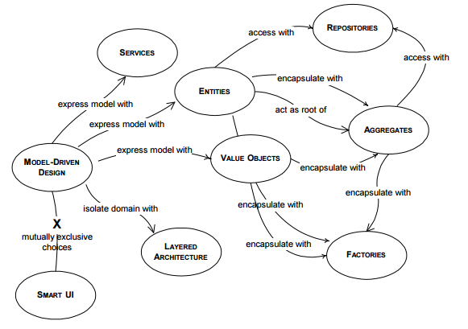
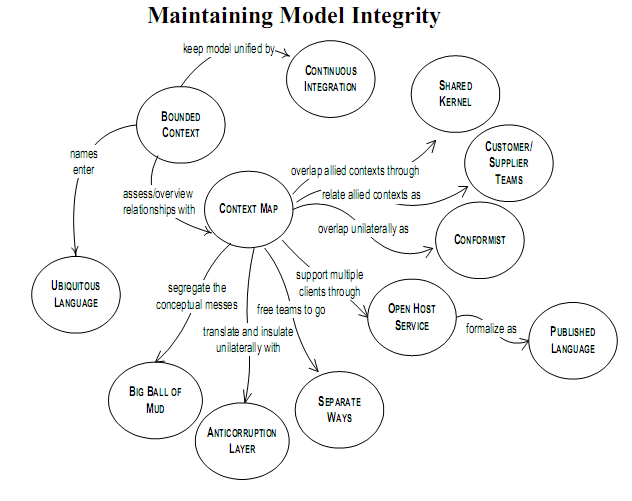
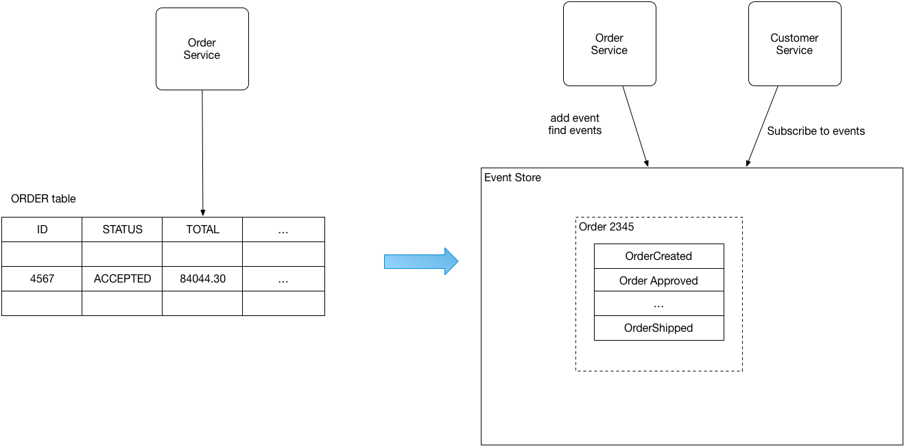
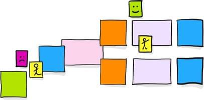
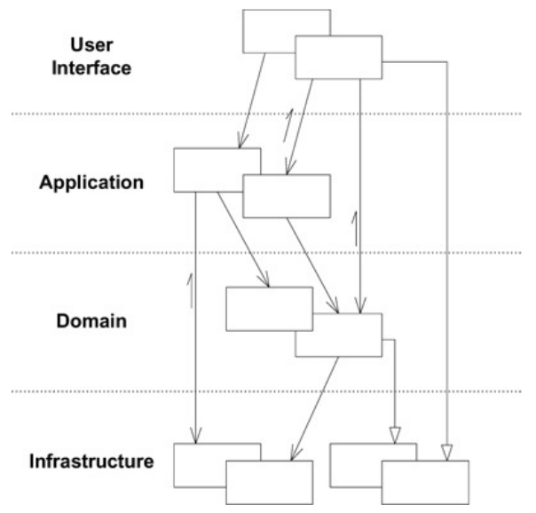
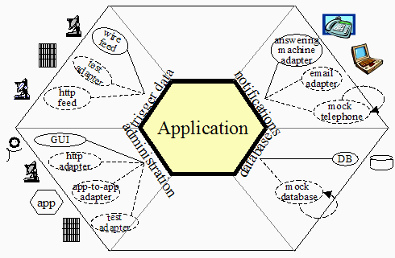
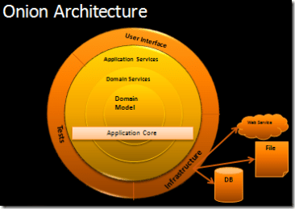
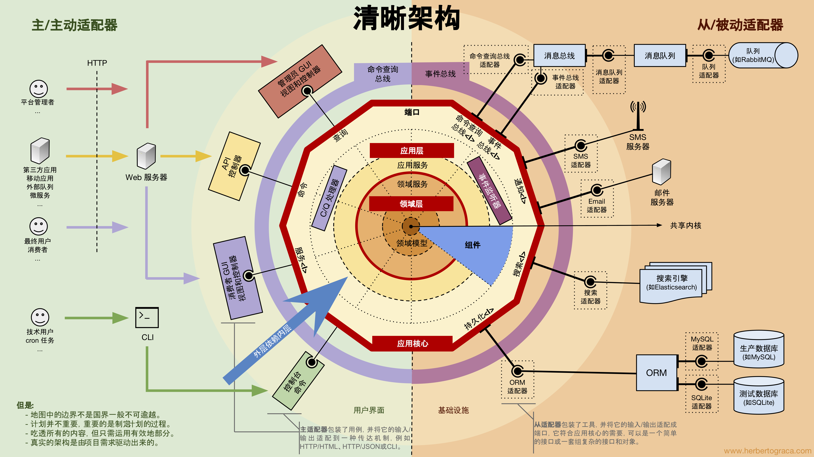

# 领域驱动设计简介

## 第一部分 运用领域模型

- 领域就是应用软件的问题域
- 领域模型是对领域知识严格的组织且有选择的抽象

- 模型的作用

  1. 模型和设计的核心相互影响
  2. 模型是团队所有成员使用的通用语言的中枢
  3. 模型是浓缩的知识

- 软件的核心是其为用户解决领域相关的问题的能力
- 通过模型获得的知识远远不知识“发现名词”。业务活动和规则如同所涉及的实体一样，都是领域的核心。

- 模式：通用语言
  - 通用语言的词汇包括类和主要操作的名称
  - 模型可能不会像领域的专业术语那样具有丰富的语义，但我们又不能直接使用那些术语，因为它们有歧义和矛盾

- 模式：模型驱动设计

## 第二部分 模型驱动设计的构造块

- 模式：实体
- 模式：值对象
- 模式：服务
  - 应用服务
  - 领域服务

Note: 实体、值对象、服务

- 模式：聚合
  - 在聚合边界内保护业务规则不变性
  - 聚合要设计的小巧
  - 只能通过标识符引用其他聚合
  - 利用最终一致性更新其他聚合

Note: 聚合

- 模式：模块
- 模式：工厂
- 模式：资源库

Note: 资源库

## 第三部分 通过重构来加深理解

- 模式：规格
- 模式：释意接口
- 模式：无副作用的函数
- 模式：断言
- 模式：策略

## 第四部分 战略设计

- 模式：限界上下文

Note: 限界上下文

- 模式：上下文映射
  - 模式：共享内核
  - 模式：客户和供应商
  - 模式：尊奉者
  - 模式：防腐层
  - 模式：各行其道
  - 模式：开放主机服务
  - 模式：发布语言

- 模式：核心域
- 模式：通用子域
- 模式：愿景说明
- 模式：高亮核心
- 模式：内聚机制
- 模式：分离核心
- 模式：抽象核心

## 更新

- 问题域和解决方案域

- 子域：
  - 核心域
  - 支撑子域
  - 通用子域

Note: 子域

- 领域事件

- 事件溯源

Note: 领域事件

- 事件风暴

Note: 事件风暴

## 架构

- 分层架构 - 2003

- 端口和适配器架构/六边形架构 - 2005

>  让用户、程序、自动化测试和批处理脚本可以平等地驱动应用，让应用的开发和测试可以独立于其最终运行的设备和数据库。

Note: 六边形架构

- 洋葱架构 - 2008

- 整洁架构 - 2012

- 清晰架构 - 2017

