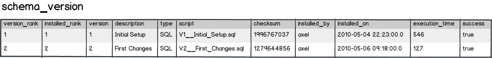
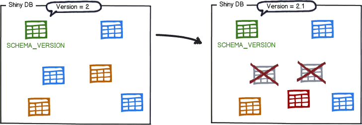
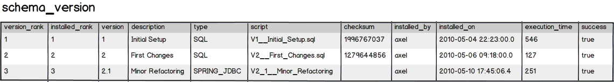
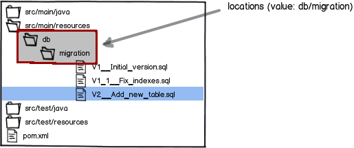

# Database Migrations


## Why database migrations


We have been pretty good at solving them on the code side.

- Version control is now universal with better tools everyday.
- We have reproducible builds and continuous integration.
- We have well defined release and deployment processes.


But what about the database?


- What state is the database in on this machine?
- Has this script already been applied or not?
- Has the quick fix in production been applied in test afterwards?
- How do you set up a new database instance?


> Database migrations are a great way to regain control of this mess.


- Recreate a database from scratch
- Make it clear at all times what state a database is in
- Migrate in a deterministic way from your current version of the database to a newer one


## How Flyway works

<!-- .slide: data-background="white" -->


### Empty Database





### Migrating to Newer Versions








## Use Flyway


### Gradle 2.1 and newer

- build.gradle

```groovy
plugins {
    id "org.flywaydb.flyway" version "3.2"
}
```


- gradle.properties

```
flyway.url=jdbc:hsqldb:file:/db/flyway_sample;shutdown=true
flyway.user=myUser
flyway.password=mySecretPwd
```





`$ gradle flywayMigrate -i`


### Spring Boot integration

Execute Flyway database migrations on startup

- add the org.flywaydb:flyway-core to your classpath


## 参考资料

- [Flyway](http://flywaydb.org/)
- [Execute Flyway database migrations on startup](http://docs.spring.io/spring-boot/docs/current/reference/htmlsingle/#howto-execute-flyway-database-migrations-on-startup)