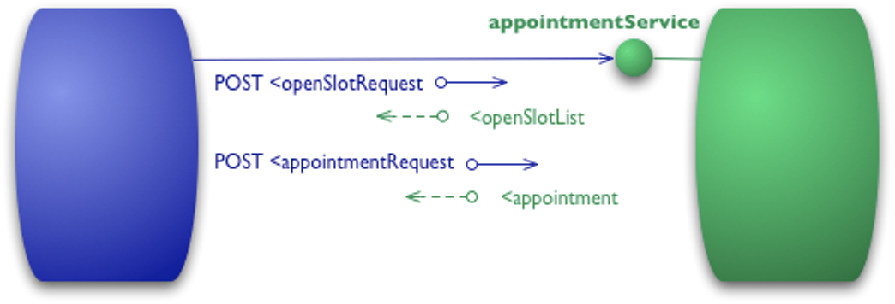
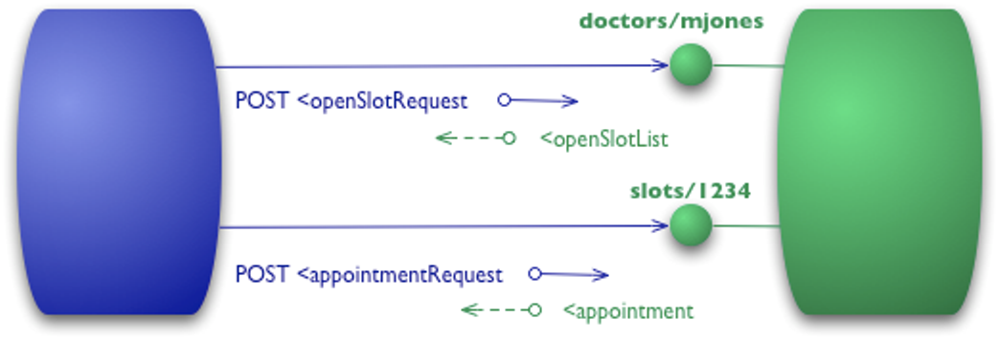
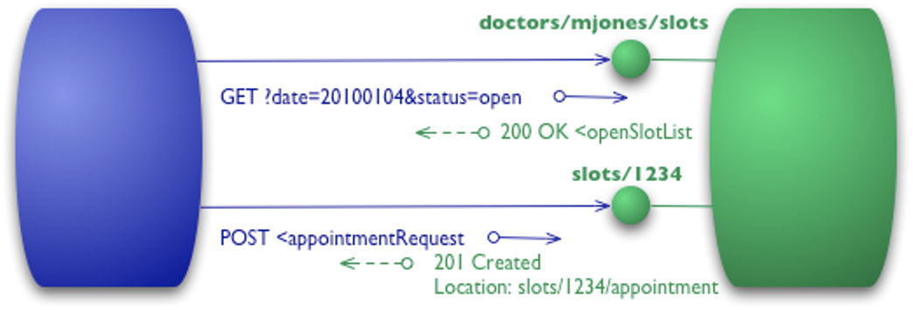

# RESTful APIs


内容

- 如何设计出标准的RESTful APIs
- RESTful和RPC的对比
- 什么是REST，REST和RESTful的关系


## RESTful APIs

- 遵守REST架构约束的Web service APIs被称作RESTful APIs


### Richardson Maturity Model


#### Level 0 - RPC




```
POST /appointmentService HTTP/1.1
[various other headers]

<openSlotRequest date = "2010-01-04" doctor = "mjones"/>
```

```
HTTP/1.1 200 OK
[various headers]

<openSlotList>
  <slot start = "1400" end = "1450">
    <doctor id = "mjones"/>
  </slot>
  <slot start = "1600" end = "1650">
    <doctor id = "mjones"/>
  </slot>
</openSlotList>
```


```
POST /appointmentService HTTP/1.1
[various other headers]

<appointmentRequest>
  <slot doctor = "mjones" start = "1400" end = "1450"/>
  <patient id = "jsmith"/>
</appointmentRequest>
```

```
HTTP/1.1 200 OK
[various headers]

<appointment>
  <slot doctor = "mjones" start = "1400" end = "1450"/>
  <patient id = "jsmith"/>
</appointment>
```

```
HTTP/1.1 200 OK
[various headers]

<appointmentRequestFailure>
  <slot doctor = "mjones" start = "1400" end = "1450"/>
  <patient id = "jsmith"/>
  <reason>Slot not available</reason>
</appointmentRequestFailure>
```


#### Level 1 - Resources




```
POST /doctors/mjones HTTP/1.1
[various other headers]

<openSlotRequest date = "2010-01-04"/>
```

```
HTTP/1.1 200 OK
[various headers]

<openSlotList>
  <slot id = "1234" doctor = "mjones" start = "1400" end = "1450"/>
  <slot id = "5678" doctor = "mjones" start = "1600" end = "1650"/>
</openSlotList>
```


```
POST /slots/1234 HTTP/1.1
[various other headers]

<appointmentRequest>
  <patient id = "jsmith"/>
</appointmentRequest>
```

```
HTTP/1.1 200 OK
[various headers]

<appointment>
  <slot id = "1234" doctor = "mjones" start = "1400" end = "1450"/>
  <patient id = "jsmith"/>
</appointment>
```


#### Level 2 - HTTP Verbs




```
GET /doctors/mjones/slots?date=20100104&status=open HTTP/1.1
Host: royalhope.nhs.uk
```

```
HTTP/1.1 200 OK
[various headers]

<openSlotList>
  <slot id = "1234" doctor = "mjones" start = "1400" end = "1450"/>
  <slot id = "5678" doctor = "mjones" start = "1600" end = "1650"/>
</openSlotList>
```


```
POST /slots/1234 HTTP/1.1
[various other headers]

<appointmentRequest>
  <patient id = "jsmith"/>
</appointmentRequest>
```

```
HTTP/1.1 201 Created
Location: slots/1234/appointment
[various headers]

<appointment>
  <slot id = "1234" doctor = "mjones" start = "1400" end = "1450"/>
  <patient id = "jsmith"/>
</appointment>
```

```
HTTP/1.1 409 Conflict
[various headers]

<openSlotList>
  <slot id = "5678" doctor = "mjones" start = "1600" end = "1650"/>
</openSlotList>
```


#### Level 3 - Hypermedia Controls

<!-- .slide: data-background="white" -->


```
GET /doctors/mjones/slots?date=20100104&status=open HTTP/1.1
Host: royalhope.nhs.uk
```

```
HTTP/1.1 200 OK
[various headers]

<openSlotList>
  <slot id = "1234" doctor = "mjones" start = "1400" end = "1450">
     <link rel = "/linkrels/slot/book"
           uri = "/slots/1234"/>
  </slot>
  <slot id = "5678" doctor = "mjones" start = "1600" end = "1650">
     <link rel = "/linkrels/slot/book"
           uri = "/slots/5678"/>
  </slot>
</openSlotList>
```


```
POST /slots/1234 HTTP/1.1
[various other headers]

<appointmentRequest>
  <patient id = "jsmith"/>
</appointmentRequest>
```

```
HTTP/1.1 201 Created
Location: http://royalhope.nhs.uk/slots/1234/appointment
[various headers]

<appointment>
  <slot id = "1234" doctor = "mjones" start = "1400" end = "1450"/>
  <patient id = "jsmith"/>
  <link rel = "/linkrels/appointment/cancel"
        uri = "/slots/1234/appointment"/>
  <link rel = "/linkrels/appointment/addTest"
        uri = "/slots/1234/appointment/tests"/>
  <link rel = "self"
        uri = "/slots/1234/appointment"/>
  <link rel = "/linkrels/appointment/changeTime"
        uri = "/doctors/mjones/slots?date=20100104@status=open"/>
  <link rel = "/linkrels/appointment/updateContactInfo"
        uri = "/patients/jsmith/contactInfo"/>
  <link rel = "/linkrels/help"
        uri = "/help/appointment"/>
</appointment>
```


> REST APIs must be hypertext-driven
> - Roy T. Fielding


### Example 1

Resource | Collection URI, such as http://api.example.com/v1/resources/
-------- | --------
GET      | List the URIs and perhaps other details of the collection's members.
PUT      | Replace the entire collection with another collection.
POST     | Create a new entry in the collection. The new entry's URI is assigned automatically and is usually returned by the operation.
DELETE   | Delete the entire collection.


Resource | Element URI, such as http://api.example.com/v1/resources/item17
-------- | --------
GET      | Retrieve a representation of the addressed member of the collection, expressed in an appropriate Internet media type.
PUT      | Replace the addressed member of the collection, or if it does not exist, create it.
POST     | Not generally used. Treat the addressed member as a collection in its own right and create a new entry in it.
DELETE   | Delete the addressed member of the collection.


### Example 2

A request for the base resource / might return something like this:

- Request

```
GET /
Accept: application/json+userdb
```
- Response

```
200 OK
Content-Type: application/json+userdb

{
    "version": "1.0",
    "links": [
        {
            "href": "/user",
            "rel": "list",
            "method": "GET"
        },
        {
            "href": "/user",
            "rel": "create",
            "method": "POST"
        }
    ]
}
```


we can find a user list by making another request for /user:

- Request

```
GET /user
Accept: application/json+userdb
```

- Response

```
200 OK
Content-Type: application/json+userdb

{
    "users": [
        {
            "id": 1,
            "name": "Emil",
            "country": "Sweden",
            "links": [
                {
                    "href": "/user/1",
                    "rel": "self",
                    "method": "GET"
                },
                {
                    "href": "/user/1",
                    "rel": "edit",
                    "method": "PUT"
                },
                {
                    "href": "/user/1",
                    "rel": "delete",
                    "method": "DELETE"
                }
            ]
        },
        {
            "id": 2,
            "name": "Adam",
            "country": "Scotland",
            "links": [
                {
                    "href": "/user/2",
                    "rel": "self",
                    "method": "GET"
                },
                {
                    "href": "/user/2",
                    "rel": "edit",
                    "method": "PUT"
                },
                {
                    "href": "/user/2",
                    "rel": "delete",
                    "method": "DELETE"
                }
            ]
        }
    ],
    "links": [
        {
            "href": "/user",
            "rel": "create",
            "method": "POST"
        }
    ]
}
```


we can create a new user by POSTing to /user:

- Request

```
POST /user
Accept: application/json+userdb
Content-Type: application/json+userdb

{
    "name": "Karl",
    "country": "Austria"
}
```

- Response

```
201 Created
Content-Type: application/json+userdb

{
    "user": {
        "id": 3,
        "name": "Karl",
        "country": "Austria",
        "links": [
            {
                "href": "/user/3",
                "rel": "self",
                "method": "GET"
            },
            {
                "href": "/user/3",
                "rel": "edit",
                "method": "PUT"
            },
            {
                "href": "/user/3",
                "rel": "delete",
                "method": "DELETE"
            }
        ]
    },
    "links": {
       "href": "/user",
       "rel": "list",
       "method": "GET"
    }
}
```


we can change existing data:

- Request

```
PUT /user/1
Accept: application/json+userdb
Content-Type: application/json+userdb

{
    "name": "Emil",
    "country": "Bhutan"
}
```

- Response

```
200 OK
Content-Type: application/json+userdb

{
    "user": {
        "id": 1,
        "name": "Emil",
        "country": "Bhutan",
        "links": [
            {
                "href": "/user/1",
                "rel": "self",
                "method": "GET"
            },
            {
                "href": "/user/1",
                "rel": "edit",
                "method": "PUT"
            },
            {
                "href": "/user/1",
                "rel": "delete",
                "method": "DELETE"
            }
        ]
    },
    "links": {
       "href": "/user",
       "rel": "list",
       "method": "GET"
    }
}
```


## Representational State Transfer (REST)

- is a software architecture style
- consisting of guidelines and best practices for creating scalable web services.
- "Architectural Styles and the Design of Network-based Software Architectures"


### Roy Thomas Fielding


- principal authors of the HTTP specification
- co-founder of the Apache HTTP Server project
- the chair of the Apache Software Foundation for its first three years


> 在为HTTP/1.1和URI的新标准设计扩展时，我认识到需要建立一个关于万维网应该如何运转的模型。这个关于整个Web应用中的交互的理想化的模型被称作表述性状态转移（REST）架构风格，成为了现代Web架构的基础。


> 这个名称“表述性状态转移”是有意唤起人们对于一个良好设计的Web应用如何运转的印象：一个由网页组成的网络（一个虚拟的状态机），用户通过选择链接（状态迁移）在应用中前进，导致下一个页面（展现应用的下一个状态）被转移给用户，并且呈现给他们，以便他们来使用。


### REST架构约束

- Client-Server
- Stateless
- Cache
- Uniform Interface
- Layered System
- Code-On-Demand (optional)


### REST架构过程视图


按照Fielding的描述，REST的统一接口由4个部分组成：

- 资源的标识
- 通过表述对资源执行的操作
- 自描述的消息
- 以及超媒体作为应用状态引擎（HATEOAS）


以HTTP为例

- 资源的标识就是资源的URI
- 资源的表述是资源在特定时刻状态的描述，可以通过在客户-服务器之间传递资源的表述，对资源执行某种操作
- 自描述的消息由一些标准的HTTP方法、可定制的HTTP头信息、可定制的HTTP响应代码组成
- 超媒体就是HTML，可以使用HTML作为引擎，驱动应用状态的迁移。


### Response Status Codes

- 100-199表示消息中包含一个临时的信息响应
- 200-299表示请求成功
- 300-399表示请求需要被重定向到另一个资源
- 400－499表示客户端发生了一个不应该重复的错误
- 500-599表示服务器端遇到了一个错误，但是客户端稍后可以得到一个更好的响应（或者通过某个其他服务器）


### 资源

- REST对于信息的核心抽象是资源。
- 任何能够被命名的信息都能够作为一个资源：
 - 一份文档或
 - 一张图片
 - 一个与时间相关的服务(比如洛杉矶今日的天气)
 - 一个其他资源的集合
 - 一个非虚拟的对象(比如一个人)等等。


 - 一篇学术论文的创作者首选的版本
 - X会议学报中发表的论文
 - 最新版本
 - 版本号1.2.7
 - 包含有Orange功能实现的修订版本


### 表述

- REST组件通过以下方式在一个资源上执行动作：使用一个表述来捕获资源的当前的或预期的状态，并在组件之间传递该表述。
- 表述的其他常用名称包括：文档、文件、HTTP消息实体、实例或变量。
- 表述由数据、描述数据的元数据、以及（有时候存在的）描述元数据的元数据组成（通常用来验证消息的完整性）。


### 内容协商

REST组件通过转移一种表述来进行通信，REST组件可以基于接收者的能力或者其期待的内容，以及资源的性质来动态地选择不同的表述


### REST Mismatches in URI

- 所有的URI中包括标识当前用户的信息


### REST Mismatches in HTTP

- Cookie

  应该通过匿名的 认证和真正的客户端状态来完成


### HTTP并不是RPC

连接器接口与过程调用在参数和结果的传递方式上有着重要的区别：

- 其传入参数由请求的控制数据、一个表示请求的目标的资源标识符、以及一个可选的表述组成。
- 其传出参数由响应的控制数据、可选的资源元数据、以及一个可选的表述组成。
- 请求是使用具有标准语义的通用的接口定向到资源的，这些语义能够被中间组件处理。结果是使得一个应用支持分层，并且独立于消息的来源，


### RPC的缺点

- 使用非标准协议，降低了可见性
- 和编程语言耦合且面向方法，难以移植
- 接口之间缺少关联
- 难以支持缓存
- 工具支持有限
- 没有一套标准状态码，格式（XML、JSON）


### HTTP并不是一种传输协议

在HTTP协议中，消息通过在那些资源的表述上的转移和操作，来对资源执一些动作，从而反映出Web架构的语义。


# 参考资料

- [Representational state transfer](https://en.wikipedia.org/wiki/Representational_state_transfer)
- [Architectural Styles and the Design of Network-based Software Architectures](http://www.ics.uci.edu/~fielding/pubs/dissertation/top.htm)
- [介绍Web基础架构设计原则的经典论文《架构风格与基于网络的软件架构设计》导读](http://www.infoq.com/cn/articles/doctor-fielding-article-review)
- [Richardson Maturity Model](http://martinfowler.com/articles/richardsonMaturityModel.html)
- [List of HTTP status codes](https://en.wikipedia.org/wiki/List_of_HTTP_status_codes)
- [What exactly is RESTful programming?](http://stackoverflow.com/questions/671118/what-exactly-is-restful-programming)
- [REST APIs must be hypertext-driven](http://roy.gbiv.com/untangled/2008/rest-apis-must-be-hypertext-driven)
