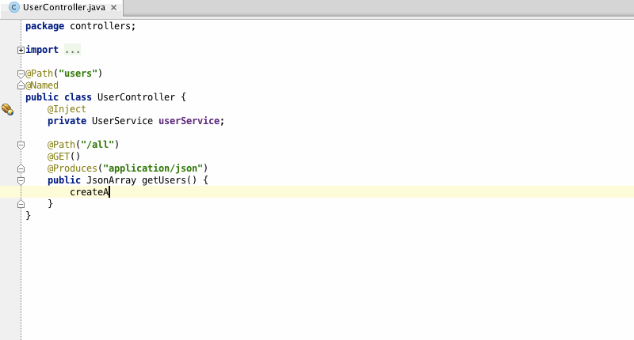
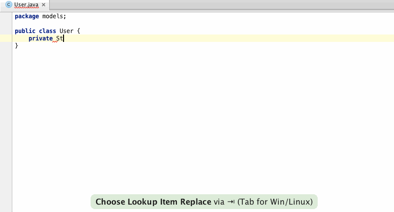
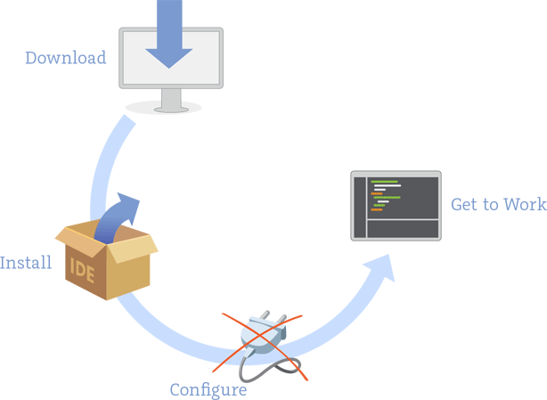

# Basic Tools


## Git

- 一个分布式版本控制系统
- 最初由Linus Torvalds在2005年设计开发


### Why Git

- 几乎所有操作都在本地
- 快速
- 小步提交的绝配
- 备份


- 直接记录快照，而非差异比较

  
  
- 轻量级的分支

Note: 完整历史 提交


### Install

http://msysgit.github.io/


### Basics

- 获取 Git 仓库
 - `$ git init`
 - `$ git clone`


- 跟踪新文件
 - `$ git add`


- 检查当前文件状态
 - `$ git status`


- 暂存已修改文件
 - `$ git add`


- 三种状态
 - 已提交（committed）
 - 已修改（modified）
 - 已暂存（staged）


- 提交更新
 - `$ git commit`


- 查看提交历史
 - `$ git log`
 - `$ git log --oneline --decorate --color --graph`


### Exercise git basics

- `$ git init`
- `$ git add`
- `$ git status`
- `$ git commit`
- `$ git log`


### config

 - `$ git config --global user.name "Qi Xi"`
 - `$ git config --global user.email xqi@thoughtworks.com`
 - `$ git config --list`


### remote

- `$ git remote -v`
- `$ git fetch`
- `$ git pull`
- `$ git push`


### branch


- `$ git branch iss53`
- `$ git checkout iss53`
- `$ git branch`


### merge

- `$ git checkout master`
- `$ git merge iss53`


- `$ git branch -d iss53`


### Exercise git branch


## GitLab

一个利用 Ruby on Rails 开发的开源应用程序，实现一个自托管的Git项目仓库，可通过Web界面进行访问公开的或者私人项目。


### CodeClub


### Merge/pull requests


### Exercise fork


## IDE

### IntelliJ IDEA

- <https://www.jetbrains.com/idea/>


### Why IntelliJ IDEA
- Write Better Code




- Be More Productive



- Start Up in No Time



## Maven

- 2002年发布 (Ant in 2000)
- 约定 (Ant write all the commands)
- XML


## Gradle

- 2012年发布
- DSL Groovy
- Android


## sbt

- Simple Build Tool
- 增量编译
- 拥有交互shell
- Scala
- DSL


build.sbt

```scala
lazy val root = (project in file(".")).
  settings(
    name := "hello",
    version := "1.0",
    scalaVersion := "2.11.4"
  )
```


目录结构

```
src/
  main/
    resources/
       <files to include in main jar here>
    scala/
       <main Scala sources>
    java/
       <main Java sources>
  test/
    resources
       <files to include in test jar here>
    scala/
       <test Scala sources>
    java/
       <test Java sources>
```


src/main/scala/Hi.scala 

```scala
object Hi {
  def main(args: Array[String]) = println("Hi!")
}
```


`$ sbt run`


## Exercise sbt and IntelliJ IDEA

- build.sbt
- Hi.scala
- IntelliJ IDEA import