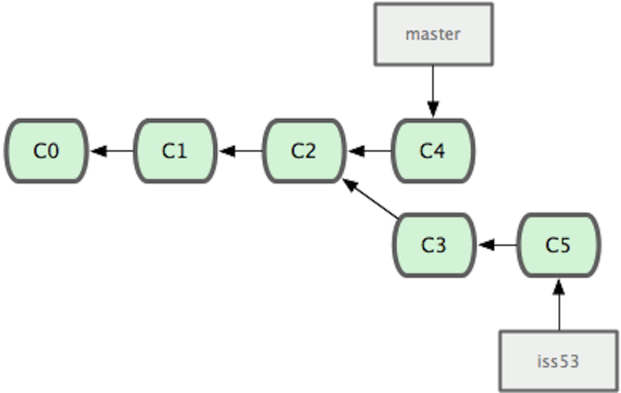
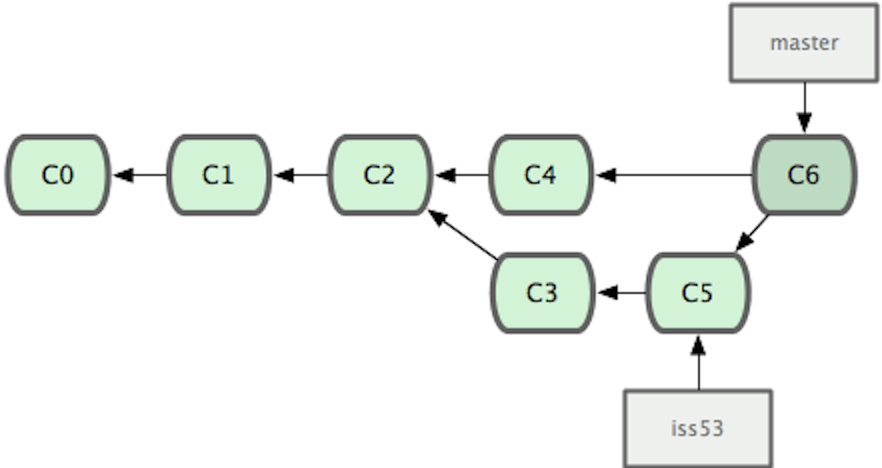
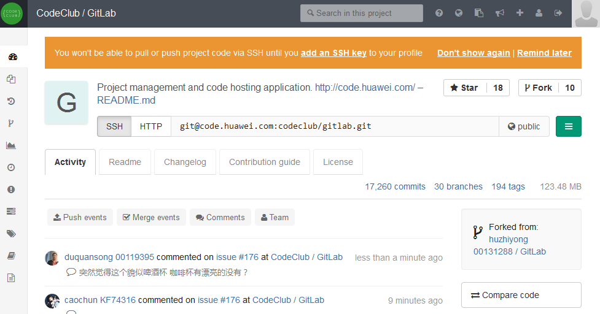

# 约定

- 只有在练习时可以使用电脑，其他时间不需要
- 不需要记笔记，资料随后会分享出来
- 手机静音
- 请随时提问
- 语速太快、慢、大、小，请随时提醒
- 请大家遵守课堂纪律


# Basic Tools


## Git

- 一个分布式版本控制系统
- 最初由Linus Torvalds在2005年设计开发


- Centralized Version Control Systems


- Distributed Version Control Systems


### Why Git

- 几乎所有操作都在本地
- 快速
- 小步提交的绝配
- 备份


- 直接记录快照，而非差异比较

  
  
- 轻量级的分支

Note: 完整历史 提交


### Install

http://msysgit.github.io/


### Basics

- 获取 Git 仓库
 - `$ git init`
 - `$ git clone`

Note: 一边演示一边操作


- 跟踪新文件
 - `$ git add`


- 检查当前文件状态
 - `$ git status`


- 暂存已修改文件
 - `$ git add`


- 三种状态
 - 已提交（committed）
 - 已修改（modified）
 - 已暂存（staged）


Note: 介绍三个区域及其流转顺序，在这个过程中对应的状态


- 提交更新
 - `$ git commit`


- 查看提交历史
 - `$ git log`
 - `$ git log --oneline --decorate --color --graph`


### Exercise git basics

- Fork http://code.huawei.com/qixi/prs-capability.git
- `$ git clone`
- `$ git add`
- `$ git status`
- `$ git commit`
- `$ git log`


### config

 - `$ git config --global user.name "Qi Xi"`
 - `$ git config --global user.email xqi@thoughtworks.com`
 - `$ git config --list`


### remote

- `$ git remote -v`
- `$ git fetch`
- `$ git pull`
- `$ git push`

Note: git pull = git fetch + git merge


### branch




- `$ git branch iss53`
- `$ git checkout iss53`
- `$ git branch`

Note: 如何创建一个分支


### merge




- `$ git checkout master`
- `$ git merge iss53`


- `$ git branch -d iss53`


### git-svn

- `$ git svn clone http://svn.example.com/project/trunk`
- `$ git svn rebase`
- `$ git svn dcommit`

Note: 可以用git操作svn仓库


## GitLab

一个利用 Ruby on Rails 开发的开源应用程序，实现一个自托管的Git项目仓库，可通过Web界面进行访问公开的或者私人项目。


### Code Club



### Merge/pull requests

- fork
- clone
- commit
- push
- merge request

Note: 动手演示


### Exercise Merge Requests

Note: 练习Merge Request，把刚才演示自己做一遍。改动内容是把自己和pair的邮箱作为文件名。


## IDE

### IntelliJ IDEA

- <https://www.jetbrains.com/idea/>
- bin/idea.exe.vmoptions `-Xmx1024m`


## Maven

- 2002年发布 (Ant in 2000)
- 约定 (Ant write all the commands)
- XML


- pom.xml

```xml
<project xmlns="http://maven.apache.org/POM/4.0.0"
         xmlns:xsi="http://www.w3.org/2001/XMLSchema-instance"
         xsi:schemaLocation="http://maven.apache.org/POM/4.0.0 http://maven.apache.org/xsd/maven-4.0.0.xsd">
  <modelVersion>4.0.0</modelVersion>
  <groupId>com.huawei</groupId>
  <artifactId>basic-tools</artifactId>
  <version>1.0.0</version>
  <packaging>war</packaging>
  <properties>
    <project.build.sourceEncoding>UTF-8</project.build.sourceEncoding>
  </properties>
  <dependencies>
    <dependency>
      <groupId>org.springframework</groupId>
      <artifactId>spring-webmvc</artifactId>
      <version>3.2.4.RELEASE</version>
    </dependency>
  </dependencies>
  <build>
    <plugins>
      <plugin>
        <groupId>org.codehaus.mojo</groupId>
        <artifactId>tomcat-maven-plugin</artifactId>
        <version>1.1</version>
      </plugin>
    </plugins>
  </build>
</project>
```

Note: XML的配置还是比较长的


## Gradle

- 2007年发布
- DSL Groovy
- Android


- build.gradle

```
apply plugin: 'java'

compileJava.options.encoding = 'UTF-8'
compileTestJava.options.encoding = 'UTF-8'
```


- build.gradle

```
apply plugin: 'jetty’
apply plugin: 'findbugs'
apply plugin: 'jacoco'

compileJava.options.encoding = 'UTF-8'
compileTestJava.options.encoding = 'UTF-8'

dependencies {
    compile "org.springframework:spring-web:3.2.4.RELEASE”
}

findbugs {
    ignoreFailures = true
    excludeFilter = file("myExcludeFilter.xml")
}

test {
    jacoco {
        excludes = ['*_javassist_*']
    }
}
```

Note: 采用DSL后配置明显简介了


## sbt

- Simple Build Tool
- 增量编译
- 拥有交互shell
- Scala
- DSL


build.sbt

```scala
lazy val root = (project in file(".")).
  settings(
    name := "hello",
    version := "1.0",
    scalaVersion := "2.11.4"
  )
```


目录结构

```
src/
  main/
    resources/
       <files to include in main jar here>
    scala/
       <main Scala sources>
    java/
       <main Java sources>
  test/
    resources
       <files to include in test jar here>
    scala/
       <test Scala sources>
    java/
       <test Java sources>
```


src/main/scala/Hi.scala 

```scala
object Hi {
  def main(args: Array[String]) = println("Hi!")
}
```


`$ sbt run`


### Exercise sbt and IntelliJ IDEA

- build.sbt

```scala
lazy val root = (project in file(".")).
  settings(
    name := "hello",
    version := "1.0",
    scalaVersion := "2.11.4"
  )
```

- src/main/scala/Hi.scala

```scala
object Hi {
  def main(args: Array[String]) = println("Hi!")
}
```

- `sbt run`

- IntelliJ IDEA Import Project


## 课后练习

https://github.com/numbbbbb/progit-zh-pdf-epub-mobi

阅读前3章，下次培训时为大家讲解rebase操作。