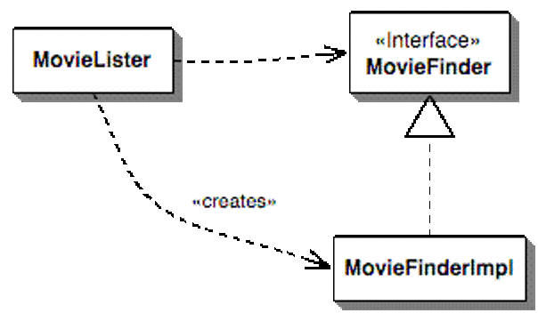

# 依赖解耦


## FizzBuzzWhizz

1. 你首先说出三个不同的特殊数，要求必须是个位数，比如3、5、7。
2. 让所有学生拍成一队，然后按顺序报数。
3. 学生报数时，如果所报数字是第一个特殊数（3）的倍数，那么不能说该数字，而要说Fizz；如果所报数字是第二个特殊数（5）的倍数，那么要说Buzz；如果所报数字是第三个特殊数（7）的倍数，那么要说Whizz。
4. 学生报数时，如果所报数字同时是两个特殊数的倍数情况下，也要特殊处理，比如第一个特殊数和第二个特殊数的倍数，那么不能说该数字，而是要说FizzBuzz, 以此类推。如果同时是三个特殊数的倍数，那么要说FizzBuzzWhizz。
5. 学生报数时，如果所报数字包含了第一个特殊数，那么也不能说该数字，而是要说相应的单词，比如本例中第一个特殊数是3，那么要报13的同学应该说Fizz。如果数字中包含了第一个特殊数，那么忽略规则3和规则4，比如要报35的同学只报Fizz，不报BuzzWhizz。


## 现状

```java
public String say() {
    final StringBuilder sb = new StringBuilder();
    if (index % fizzGame.getNumber1() == 0) {
        sb.append("Fizz");
    }
    if (index % fizzGame.getNumber2() == 0) {
        sb.append("Buzz");
    }
    if (index % fizzGame.getNumber3() == 0) {
        sb.append("Whizz");
    }
    if (sb.length() != 0) {
        return sb.toString();
    }
    return String.valueOf(index);
}
```

Note: 违反了开闭原则；存在两个规则


# Tasking

- 重构当前代码，支持增加新的规则
- 增加新的规则


## 重构

```java
private List<GameRule> rules;

public String say() {
    for (GameRule rule : rules) {
        final Optional<String> result = rule.say(index);
        if (result.isPresent()) {
            return result.get();
        }
    }

    throw new IllegalStateException();
}
```

Note: 先重构再增加新功能；简单设计


## rules的创建

```java
public Student(FizzGame fizzGame, int index) {
    rules = Lists.newArrayList(new MultipleGameRule(fizzGame), new DefaultGameRule());
    this.index = index;
}
```

Note: 违反了依赖反转原则


<!-- .slide: data-background="white" -->

## 控制反转 Inversion of Control



Figure 1 shows the dependencies for this situation. The MovieLister class is dependent on both the MovieFinder interface and upon the implementation.


<!-- .slide: data-background="white" -->

### Dependency Injection


### IoC

The main control of the program was inverted, moved away from you to the framework.


## Exercise 1

```java
public Student(List<GameRule> rules, int index) {
    this.rules = rules;
    this.index = index;
}
```
- 所有测试都要通过


### IntelliJ IDEA 快捷键

Key                  | Description
-------------------- | -----------
`Ctrl + Alt + P`     | Extract parameter
`Ctrl + F6`          | Change method signature

http://www.jetbrains.com/idea/docs/IntelliJIDEA_ReferenceCard.pdf


# Mock


## 测试Student

反例

```java
@Test
public void student_1_should_say_1() throws Exception {
    final MultipleGameRule rule1 = new MultipleGameRule(fizzGame);
    final DefaultGameRule rule2 = new DefaultGameRule();
    final ArrayList<GameRule> rules = Lists.newArrayList(rule1, rule2);
    final Student student = new Student(rules, 1);

    assertThat(student.say(), is("1"));
}
```

Note: 同时把MultipleGameRule等其他类引入了该测试


## SUT

- System Under Test


## Student的测试

- Case 1
 - Given两个规则
 - When第一个规则返回了Fizz
 - Then返回Fizz
- Case 2
 - Given两个规则
 - When第一个规则没有返回值
 - 而第二个规则返回了Buzz
 - Then返回Buzz


## Case 1

```java
@Test
public void say_fizz_when_first_rule_return_fizz() throws Exception {
    final GameRule rule1 = new GameRule() {
        @Override
        public Optional<String> say(int index) {
            return Optional.of("Fizz");
        }
    };
    final GameRule rule2 = new GameRule() {
        @Override
        public Optional<String> say(int index) {
            return Optional.absent();
        }
    };
    final Student student = new Student(Lists.newArrayList(rule1, rule2), 1);
    assertThat(student.say(), is("Fizz"));
}
```


## Exercise 2

实现Case 2


## Mockito

```java
import static org.mockito.Mockito.*;

List mockedList = mock(List.class);

when(mockedList.get(0)).thenReturn("first");
when(mockedList.get(1)).thenThrow(new RuntimeException());

assertThat(mockedList.get(0), is("first"));

```


## Test Double

- Dummy

 objects are passed around but never actually used. Usually they are just used to fill parameter lists.

- Fake

 objects actually have working implementations, but usually take some shortcut which makes them not suitable for production (an in memory database is a good example).


- Stubs

 provide canned answers to calls made during the test, usually not responding at all to anything outside what's programmed in for the test. Stubs may also record information about calls, such as an email gateway stub that remembers the messages it 'sent', or maybe only how many messages it 'sent'.

- Mocks

 objects pre-programmed with expectations which form a specification of the calls they are expected to receive.


## Mockito Stub

```java
Car boringStubbedCar = when(mock(Car.class).shiftGear())
        .thenThrow(EngineNotStarted.class)
        .getMock();

doThrow(new RuntimeException()).when(mockedList).clear();
```


## Mockito Mock

```java
List mockedList = mock(List.class);

mockedList.add("one");
mockedList.clear();

verify(mockedList).add("one");
verify(mockedList).clear();
```


## Argument matchers

```java
when(mockedList.get(anyInt())).thenReturn("element");

assertThat(mockedList.get(999), is("element"));

verify(mockedList).get(anyInt());
```


## Verifying number of invocations

```java
mockedList.add("twice");
mockedList.add("twice");

mockedList.add("three times");
mockedList.add("three times");
mockedList.add("three times");

verify(mockedList, times(2)).add("twice");

verify(mockedList, never()).add("never happened");
verify(mockedList, atLeastOnce()).add("three times");
verify(mockedList, atLeast(2)).add("five times");
verify(mockedList, atMost(5)).add("three times");
```


## Exercise 3

- 把StudentTest用Mockito改写


## 重构完成

- <del>重构当前代码，支持增加新的规则</del>
- 增加新的规则


## ScalaTest with Mockito

ScalaTest's `MockitoSugar` trait provides some basic syntax sugar for Mockito.

- Using the Mockito API directly, you create a mock with:

```scala
val mockCollaborator = mock(classOf[Collaborator])
```

- Using this trait, you can shorten that to:

```scala
val mockCollaborator = mock[Collaborator]
```


```scala
// First, create the mock object
val mockCollaborator = mock[Collaborator]

// Create the class under test and pass the mock to it
classUnderTest = new ClassUnderTest
classUnderTest.addListener(mock)

// Use the class under test
classUnderTest.addDocument("Document", new Array[Byte](0))
classUnderTest.addDocument("Document", new Array[Byte](0))
classUnderTest.addDocument("Document", new Array[Byte](0))
classUnderTest.addDocument("Document", new Array[Byte](0))

// Then verify the class under test used the mock object as expected
verify(mockCollaborator).documentAdded("Document")
verify(mockCollaborator, times(3)).documentChanged("Document")
```


# 课后练习

- 完成Scala版本的StudentSpec
- 为MultipleGameRule编写Java测试
- 为DefaultGameRule编写Java测试
- Merge Request


# 参考资料

- [SOLID](https://en.wikipedia.org/wiki/SOLID_%28object-oriented_design%29)
- [Inversion of Control Containers and the Dependency Injection pattern](http://www.martinfowler.com/articles/injection.html)
- [Mocks Aren't Stubs](http://martinfowler.com/articles/mocksArentStubs.html)
- [Mockito](http://site.mockito.org/mockito/docs/current/org/mockito/Mockito.html)