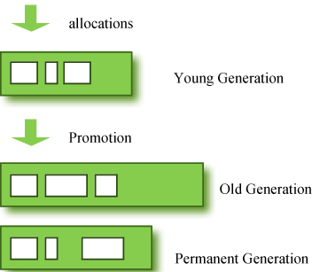
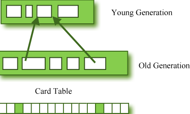
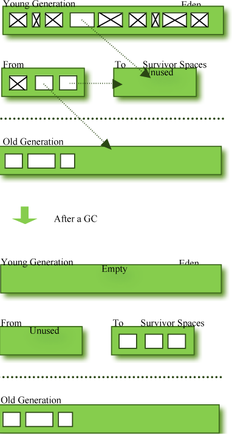

# Homework Review

# Performance 2

## HotSpot VM的基本架构

- HotSpot VM运行时
- 垃圾收集器
- JIT编译器

## 内存结构

### 弱分代假设(Weak Generational Hypothesis)

- 大多数分配对象的存活时间很短
- 存活时间久的对象很少引用存活时间短的对象

### 内存结构

- 堆(Heap)
 - 新生代(Young generation)
 - 老年代(Old generation/tenured generation)
- Non Heap
 - 永久代(Permanent generation) 

### card table

> What if an object in the old generation need to reference an object in the young generation?

## 堆结构

- 新生代
 - Eden
 - 一对Survivor
- 老年代

## Minor GC

Note: 图有问题

- 过早提升(Premature Promotion)
- 提升失败(Promotion Failure)

## 快速内存分配

- 指针碰撞(Bump-the-Pointer)
- TLAB(Thread-Local Allocation Buffer)

## 内存泄漏(Memory Leak)

- 什么是内存泄漏
- 如何发现
 - Profiling
 - Heap Statistics
 - Object Count

## 其他应用内存问题

## Exercise 1

- `$ JAVA_OPTS="-server -XX:+UnlockCommercialFeatures -XX:+FlightRecorder" sbt test:run -mem 512`
- 修复内存泄漏
- 优化应用

Note: 重启sbt

## JVM性能调优步骤

1. 确定需求
2. 选择JVM部署模式
3. 选择JVM运行时环境
4. 垃圾收集器调优
 - 满足程序内存需求
 - 时间延迟要求
 - 吞吐量要求

## 应用程序的系统需求

- 可用性
- 可管理性
- 吞吐量
- 延迟及响应性
- 内存占用
- 启动时间

## 垃圾收集调优原则

1. Minor GC回收原则，减少Full GC
2. GC内存最大化原则
3. GC调优的3选2原则：吞吐量、延迟、内存占用

## 设置内存

VM Arguments                 | Description
------------                 | -----------
`-Xms<n>[g/m/k]`             | 堆空间初始值、最小值
`-Xmx<n>[g/m/k]`             | 堆空间最大值
`-Xmn<n>[g/m/k]`             | 新生代空间的初始值、最小以及最大值
`-XX:PermSize=<n>[g/m/k]`    | 永久代空间的初始值、最小值
`-XX:MaxPermSize=<n>[g/m/k]` | 永久代空间的最大值

堆空间 = 新生代空间 + 老年代

Note: 最大值和最小值要一致，否则在动态调整时会引起Full GC

## 初始堆空间大小配置

Space     | Value                            | 举例（老年代17m、永生代58m）
-----     | -----                            | ---------------------------
Java Heap | 3-4倍Full GC后老年代空间大小     | 51m-68m
新生代    | 1-1.5倍Full GC后老年代空间大小   | 17m-25.5m
老年代    | 2-3倍Full GC后老年代空间大小     | 23m-51m
永久代    | 1.2-1.5倍Full GC后永久代空间大小 | 43m-54m

`JAVA_OPTS="-Xms51m -Xmx51m -Xmn17m -XX:PermSize=43m -XX:MaxPermSize=43m -server -XX:+UnlockCommercialFeatures -XX:+FlightRecorder" sbt test:run`

## 调优延迟/响应性

### 新生代

- 空间越小，Minor GC时间越短，频率越高
- 新生代大小和频率成反比
- 调整新生代大小时同时保持老年代大小不变

### 老年代

- Full GC引入的最差停滞时间
- Full GC的频率

## 应用程序吞吐量调优

- 尽可能避免发生Full GC
- 优化老化频率
- `-XX:SurvivorRatio=6`

Note: 例子：先降低Minor GC频率（调整新生代），再减少Full GC（调整Survivor）

Heap | 新生代 | Eden  | Survivor | SurvivorRatio | 老年代 | 永久代
---- | ------ | ----  | -------- | ------------- | ------ | ------
51   | 17     |  13   | 2        | 6             | 34     | 43
84   | 50     |  37.5 | 6.25     | 6             | 34     | 43
104  | 70     |  42   | 14       | 3             | 34     | 43

## Exercise 2

- 调优延迟/响应性 - 调整Minor GC时间和频率
- 调优延迟/响应性 - 调整Full GC时间和频率
- 调优吞吐量 - 避免发生Full GC

## 垃圾收集器

- Serial GC
- Parallel GC
- Concurrent Mark & Sweep GC  (or "CMS")
- Garbage First (G1) GC

### Serial GC & Parallel GC

- mark-sweep-compact
- Stop-The-World

## 课后练习

找出3个项目代码中性能优化点

- 提交优化数据(Merge Request)

# 参考资料

- [Understanding Java Garbage Collection](http://www.cubrid.org/blog/dev-platform/understanding-java-garbage-collection/)
- [Java Platform, Standard Edition Troubleshooting Guide](https://docs.oracle.com/javase/8/docs/technotes/guides/troubleshoot/toc.html)
