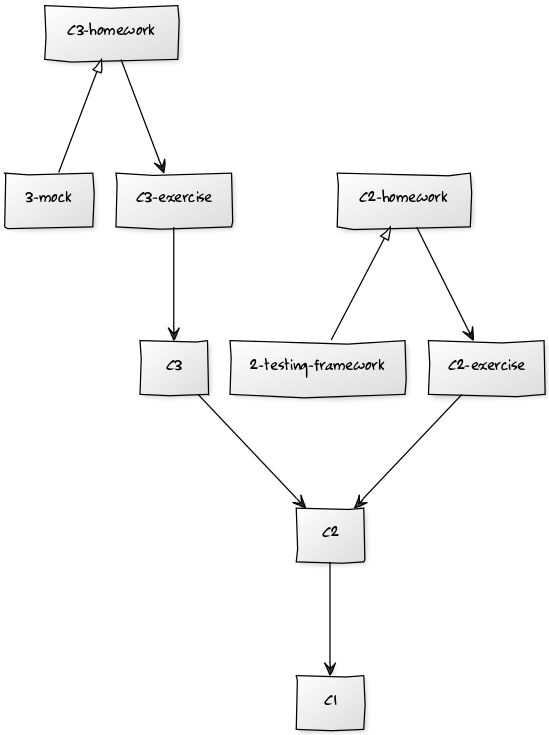

# Homework Review


## 获取基础代码

- `$ git fetch upstream master`
- `$ git checkout -b 3-mock upstream/master`


<!-- .slide: data-background="white" -->



Note: http://yuml.me/diagram/scruffy/class/%5BC3%5D-%3E%5BC2%5D,%5BC2%5D-%3E%5BC1%5D,%5BC2-exercise%5D-%3E%5BC2%5D,%5BC2-homework%5D-%3E%5BC2-exercise%5D,%5BC2-homework%5D%5E-%5B2-testing-framework%5D,%5BC3-exercise%5D-%3E%5BC3%5D,%5BC3-homework%5D-%3E%5BC3-exercise%5D,%5BC3-homework%5D%5E-%5B3-mock%5D


## push.default

- matching
- simple


- `$ git config --global push.default simple`
- `$ git push --set-upstream origin your-branch-name`


# Test-driven development (TDD)


## FizzBuzzWhizz

1. 你首先说出三个不同的特殊数，要求必须是个位数，比如3、5、7。
2. 让所有学生拍成一队，然后按顺序报数。
3. 学生报数时，如果所报数字是第一个特殊数（3）的倍数，那么不能说该数字，而要说Fizz；如果所报数字是第二个特殊数（5）的倍数，那么要说Buzz；如果所报数字是第三个特殊数（7）的倍数，那么要说Whizz。
4. 学生报数时，如果所报数字同时是两个特殊数的倍数情况下，也要特殊处理，比如第一个特殊数和第二个特殊数的倍数，那么不能说该数字，而是要说FizzBuzz, 以此类推。如果同时是三个特殊数的倍数，那么要说FizzBuzzWhizz。
5. 学生报数时，如果所报数字包含了第一个特殊数，那么也不能说该数字，而是要说相应的单词，比如本例中第一个特殊数是3，那么要报13的同学应该说Fizz。如果数字中包含了第一个特殊数，那么忽略规则3和规则4，比如要报35的同学只报Fizz，不报BuzzWhizz。


## Tasking

- <del>重构当前代码，支持增加新的规则</del>
- 增加新的规则


## 第一步做什么？


## 目标：Clean code that works


## Overview

- a software development process
- 极限编程
- by Kent Beck


## 测试驱动开发的规则

- 只有在测试失败时，我们才写新的代码
- 消除重复


## 这意味着

- 用测试来驱动开发
- 一边写测试一边开发
- 开发环境可以对小改动快速响应
- 为方便测试，代码必须高内聚低耦合


## 步骤

<!-- .slide: data-background="white" -->


## 动机是什么？

TDD是一种可以在开发过程中控制忧虑感的开发方法


### 担忧的负面影响

- 让你犹豫不决
- 不愿意与别人交流
- 羞于面对反馈
- 脾气暴躁


### 我们需要

- 尽快开始动手
- 更多参与沟通与交流
- 主动寻求反馈
- 改掉脾气暴躁（这个还是要靠自己）

Note: 使用TDD让开发分解成一个个相对简单容易的步骤，然后各个击破


## 更新代码

Note: FizzGameMain和GameInput


## 程序的输入

```java
public static void main(String[] args) {
    final GameInput gameInput = new GameInput(3, 5, 7);
    final List<GameRule> rules = Lists.newArrayList(new ContainGameRule(gameInput.getNumber1()), new MultipleGameRule(gameInput), new DefaultGameRule());
    for (int i = 1; i <= 100; i++) {
        System.out.println(new Student(rules, i).say());
    }
}
```


## Exercise 1

- when `sbt "run 4 5 6"` student 4 should say Fizz
- when `sbt "run 3 5"` it should throw RuntimeException

Note: 三角法


# Behavior-driven development (BDD)

- a software development process
- developed by Dan North
- as a response to the issues encountered teaching TDD


- Test method names should be sentences
- A simple sentence template keeps test methods focused
- An expressive test name is helpful when a test fails
- `Behaviour` is a more useful word than `test`
- given-when-then template
 - Given some initial context (the givens)
 - When an event occurs
 - then ensure some outcomes


## 2 levels of TDD

- Acceptance TDD
- Developer TDD


## Exercise 2

- <del>重构当前代码，支持增加新的规则</del>
- 增加新的规则

Note: 测试用例怎么写？


# Composite Pattern

<!-- .slide: data-background="white" -->


## Exercise 3

- Refactor Student

Note: 有测试保障


# 测试金字塔

<!-- .slide: data-background="white" -->


Note: UI tests is brittle, expensive to write, and time consuming to run. high-level tests are there as a second line of test defense. If you get a failure in a high level test, not just do you have a bug in your functional code, you also have a missing unit test.


## 回顾

mock(GameInput.class)


### mock is not the silver-bullet

Note: mock的坏处。只mock外部依赖


### 测试是需要维护的


绝大部分问题都是人的问题

Note: 是不是一定要TDD、一定要测试先行？


# 课后练习

## input

- when `sbt "run 3 5"`
 - it should not throw RuntimeException
 - it should print `invalid input` in stderr (using System Rules)
 - it should return 1 `System.exit(1)` (using System Rules)
- 其他情况


# 参考资料

- [Test Driven Development: By Example](http://www.amazon.com/Test-Driven-Development-By-Example/dp/0321146530)
- [UnitTest](http://martinfowler.com/bliki/UnitTest.html)
- [Introduction to Test Driven Development](http://agiledata.org/essays/tdd.html)
- [Introducing BDD](http://dannorth.net/introducing-bdd/)
- [Stop mocking, start newing](http://mrcoder.github.io/stop-mocking-start-newing/)
- [Java refactoring features of IntelliJ IDEA](https://www.jetbrains.com/idea/features/refactoring.html)