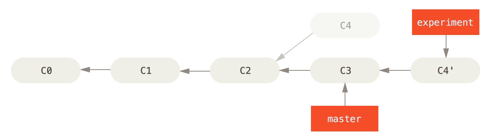
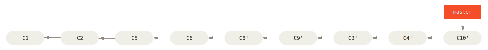

# 上节课后练习 rebase





### 好处





### 风险

> 一旦分支中的提交对象发布到公共仓库，就千万不要对该分支进行衍合操作。


# Testing Framework


## JUnit

- http://junit.org/
- 是一个Java单元测试框架
- A research survey performed in 2013 across 10,000 GitHub projects found that JUnit, along with slf4j-api, are the most popular libraries. Each library was used by 30.7% of projects.


### Create a test

```java
import org.junit.Test;

import static org.junit.Assert.assertTrue;

public class MyTest {
    @Test
    public void testNewArray() throws Exception {
        final boolean result = false;
        assertTrue(result);
    }
}
```


### Assertions

```
java.lang.AssertionError
	at org.junit.Assert.fail(Assert.java:86)
	at org.junit.Assert.assertTrue(Assert.java:41)
	at org.junit.Assert.assertTrue(Assert.java:52)
	at macdao.MyTest.testNewArray(MyTest.java:11)
```


### assertThat

```java
assertThat([value], [matcher statement]);
```

Note: Joe Walnes built a new assertion mechanism on top of what was then JMock 1


```java
import org.junit.Test;

import static org.hamcrest.CoreMatchers.is;
import static org.junit.Assert.assertThat;

public class MyTest {
    @Test
    public void testNewArray() throws Exception {
        final boolean result = false;
        assertThat(result, is(true));
    }
}

```
```
Expected: is <true>
     but: was <false>
```


### matchers

- org.hamcrest.CoreMatchers

```java
assertThat("good", is("good"));

assertThat(new Object(), notNullValue());

assertThat(new Object(), not(sameInstance(new Object())));

assertThat("good", startsWith("goo"));

assertThat(Arrays.asList(1, 2), hasItem(1));
```


```java
assertThat("fab", both(containsString("a")).and(containsString("b")));

assertThat("good", not(allOf(equalTo("bad"), equalTo("good"))));

assertThat("good", anyOf(equalTo("bad"), equalTo("good")));

assertThat(7, not(either(equalTo(3)).or(equalTo(4))));
```


### Ignoring a Test

```java
@Ignore("Test is ignored as a demonstration")
@Test
public void testSame() {
    assertThat(1, is(1));
}
```


### fixture annotations

```java
import org.junit.*;
import static java.lang.System.out;
public class MyTest {
    @BeforeClass
    public static void setUpClass() { out.println("@BeforeClass"); }
    @AfterClass
    public static void tearDownClass() { out.println("@AfterClass"); }
    @Before
    public void setUp() throws Exception { out.println("@Before"); }
    @After
    public void tearDown() throws Exception { out.println("@After"); }
    @Test
    public void test1() throws Exception { out.println("test1"); }
    @Test
    public void test2() throws Exception { out.println("test2"); }
}
```
```
@BeforeClass
@Before
test1
@After
@Before
test2
@After
@AfterClass
```


### Exercise 1

你是一名体育老师，在某次课距离下课还有五分钟时，你决定搞一个游戏。

此时有100名学生在上课。游戏的规则是：

1. 你首先说出三个不同的特殊数，要求必须是个位数，比如3、5、7。
2. 让所有学生拍成一队，然后按顺序报数。
3. 学生报数时：
  - 如果所报数字是第一个特殊数（3）的倍数，那么不能说该数字，而要说Fizz；
  - 如果所报数字是第二个特殊数（5）的倍数，那么要说Buzz；
  - 如果所报数字是第三个特殊数（7）的倍数，那么要说Whizz。


编写Student的测试

- 当三个特殊数是3、5、7时，学生1说1
- 当三个特殊数是3、5、7时，学生3说Fizz
- 当三个特殊数是3、5、7时，学生5说Buzz
- 当三个特殊数是3、5、7时，学生7说Whizz


- `$ git remote add upstream http://code.huawei.com/qixi/prs-capability.git`
- `$ git fetch upstream master`
- `$ git checkout -b 2-testing-framework upstream/master`


- `$ sbt -mem 500`
- `> ~test`


### IntelliJ IDEA 快捷键

Key                  | Description
-------------------- | -----------
`Alt + Enter`        | Quick fixes
`Ctrl + Shift + T`   | Create new test/go to test
`Alt + Insert`       | Generate test
`Ctrl + Alt + V`     | Extract variable
`Ctrl + Alt + F`     | Extract field
`Ctrl + Shift + F10` | Run test

http://www.jetbrains.com/idea/docs/IntelliJIDEA_ReferenceCard.pdf


### Expected Exceptions

```java
@Test(expected = IndexOutOfBoundsException.class)
public void empty() {
     new ArrayList<Object>().get(0);
}
```


```java
@Test
public void testExceptionMessage() {
    try {
        new ArrayList<Object>().get(0);
        fail("Expected an IndexOutOfBoundsException to be thrown");
    } catch (IndexOutOfBoundsException exception) {
        assertThat(exception.getMessage(), is("Index: 0, Size: 0"));
    }
}
```


```java
@Rule
public ExpectedException thrown = ExpectedException.none();

@Test
public void shouldTestExceptionMessage() throws IndexOutOfBoundsException {
    List<Object> list = new ArrayList<Object>();

    thrown.expect(IndexOutOfBoundsException.class);
    thrown.expectMessage("Index: 0, Size: 0");
    list.get(0); // execution will never get past this line
}
```


### System Rules

```java
public void MyTest {
	@Rule
	public final SystemOutRule systemOutRule = new SystemOutRule().enableLog();

	@Test
	public void writesTextToSystemOut() {
		System.out.print("hello world");
		assertEquals("hello world", systemOutRule.getLog());
	}
}
```


### Exercise 2

编写FizzGameTest的测试

- 输出应该是100行
- 当输入是3、5、7时，学生1说1
- 当输入是3、5、7时，学生3说Fizz
- 当输入是3、5、7时，学生5说Buzz


## ScalaTest

- http://www.scalatest.org/
- 可以测试Java和Scala


### FunSuite

```scala
import org.scalatest.FunSuite

class SetSuite extends FunSuite {

  test("An empty Set should have size 0") {
    assert(Set.empty.size == 0)
  }

  test("Invoking head on an empty Set should produce NoSuchElementException") {
    intercept[NoSuchElementException] {
      Set.empty.head
    }
  }
}
```


### FlatSpec

```scala
import org.scalatest.FlatSpec

class SetSpec extends FlatSpec {

  "An empty Set" should "have size 0" in {
    assert(Set.empty.size == 0)
  }

  it should "produce NoSuchElementException when head is invoked" in {
    intercept[NoSuchElementException] {
      Set.empty.head
    }
  }
}
```


### FunSpec

```scala
import org.scalatest.FunSpec

class SetSpec extends FunSpec {

  describe("A Set") {
    describe("when empty") {
      it("should have size 0") {
        assert(Set.empty.size == 0)
      }

      it("should produce NoSuchElementException when head is invoked") {
        intercept[NoSuchElementException] {
          Set.empty.head
        }
      }
    }
  }
}
```


### path.FunSpec

```scala
import org.scalatest.path

class SetSpec extends path.FunSpec {
  describe("A Set") {
    describe("when empty") {
      Console.println("when empty")
      it("should have size 0") {
        assert(Set.empty.size == 0)
      }

      it("should produce NoSuchElementException when head is invoked") {
        intercept[NoSuchElementException] {
          Set.empty.head
        }
      }
    }
  }
}
```


### Using assertions

```scala
val left = 2
val right = 1
assert(left == right)
```


```scala
val a = 5
val b = 2
assertResult(2) {
  a - b
}
```


```scala
intercept[IndexOutOfBoundsException] {
  "hi".charAt(-1)
}
```


### Using matchers

```scala
class StudentSpec extends path.FunSpec with Matchers
```


```scala
Array(1, 2) should equal (Array(1, 2))

val array: Array[Int] = Array(1, 2); array should be theSameInstanceAs array

None should be (None)

"abc" should have length 3

"Hello seven world" should startWith ("Hello")

"Hello seven world" should include ("seven")

"Hello seven world" should startWith regex "Hel*o"

1 should be < 7
```


```scala
new File(".") shouldBe 'directory

new File(".") should be a 'directory

new File(".") should not be a ('file)

"" shouldBe 'empty

"" shouldBe empty

all (Array(1,2,3)) should be < 10

5 should (be > 0 and be <= 10)

None should (equal (Some(List(1, 2, 3))) or be (None))
```


### Exercise 3

编写Student的测试

- 当三个特殊数是3、5、7时，学生1说1
- 当三个特殊数是3、5、7时，学生3说Fizz
- 当三个特殊数是4、5、6时，学生1说1
- 当三个特殊数是4、5、6时，学生3说3
- 当三个特殊数是4、5、6时，学生4说Fizz


## Some(SSH keys)

- http://code.huawei.com/qixi/prs-capability.git
- git@code.huawei.com:qixi/prs-capability.git


- `$ ssh-keygen -t rsa -C "qixi@huawei.com"`
- `$ clip < ~/.ssh/id_rsa.pub`
- Add SSH Key on Code Club


## Some(build.sbt)

```scala
lazy val root = (project in file(".")).
  settings(
    name := "2-testing-framework",
    version := "1.0",
    scalaVersion := "2.11.4",
    libraryDependencies += "org.scalatest" %% "scalatest" % "2.2.4" % "test",
    libraryDependencies += "com.novocode" % "junit-interface" % "0.11" % "test",
    libraryDependencies += "com.github.stefanbirkner" % "system-rules" % "1.11.0" % "test",
    libraryDependencies += "commons-io" % "commons-io" % "2.0" % "test" force(),
    crossPaths := false
  )
```


## Some(.gitignore)

```
# idea project directory
.idea/
target
# will match my.o and my.a
*.[oa]
# will match hello and hellp but not hellop
hell?
```


## 课后练习

- 需求

 学生报数时，如果所报数字同时是两个特殊数的倍数情况下，也要特殊处理，比如第一个特殊数和第二个特殊数的倍数，那么不能说该数字，而是要说FizzBuzz，以此类推。如果同时是三个特殊数的倍数，那么要说FizzBuzzWhizz。

- 有FizzGame和Student的测试和实现
- 提交到Code Club上并发Merge Request
