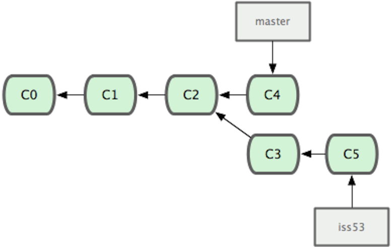
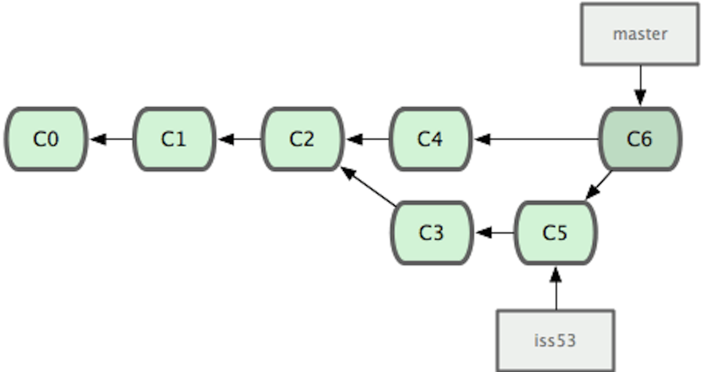
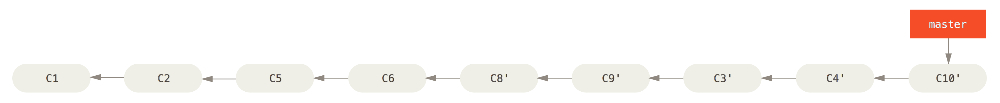

# Git

- 一个分布式版本控制系统
- 最初由Linus Torvalds在2005年设计开发


- Centralized Version Control Systems


- Distributed Version Control Systems


## Why Git

- 可以本地操作
- 快速
- 小步提交的绝配
- 备份
- 轻量级的分支


## Basics

- `$ git init`
- `$ git clone`
- `$ git add`
- `$ git status`
- `$ git commit`
- `$ git log`
- `$ git log --oneline --decorate --color --graph`
- `$ git help add`


- 三种状态
 - 已提交（committed）
 - 已修改（modified）
 - 已暂存（staged）


## branch




- `$ git branch iss53`
- `$ git checkout iss53`
- `$ git branch`

Note: 如何创建一个分支


## merge




- `$ git checkout master`
- `$ git merge iss53`


- `$ git branch -d iss53`


### Exercise

#### at the beginning

```javascript
removeData: function( elem, name ) {
    dataUser.remove( elem, name );
},
```


#### on branch master

- rename removeData to deleteData

```javascript
- removeData: function( elem, name ) {
+ deleteData: function( elem, name ) {
      dataUser.remove( elem, name );
  },
```


#### on branch my-feature

- add try catch

```javascript
  removeData: function( elem, name ) {
-     dataUser.remove( elem, name );
+     try { dataUser.remove( elem, name ); }
+     catch ( e ) { console.log( e ); }
  },
```

- add parameter callback to removData

```javascript
- removeData: function( elem, name ) {
+ removeData: function( elem, name, callback ) {
      try { dataUser.remove( elem, name ); }
      catch ( e ) { console.log( e ); }
  },
```


#### finally

```javascript
deleteData: function( elem, name, callback ) {
    try { dataUser.remove( elem, name ); }
    catch ( e ) { console.log( e ); }
},

```


- `$ git clone git@github.com:macdao/training-kingsoft-git.git`
- `$ cd training-kingsoft-git`
- `$ git branch --all`
- `$ git merge origin/my-feature`
- fix conflicts
- `$ git add .`
- `$ git commit`


## rebase


### 好处





### 风险

> 一旦分支中的提交对象发布到公共仓库，就千万不要对该分支进行rebase操作。


### Exercise

- `$ git reset --hard origin/master`
- `$ git checkout my-feature`
- `$ git rebase master`
- fix conflicts
- `$ git add .`
- `$ git rebase --continue`
- `$ git checkout master`
- `$ git merge my-feature`


# 参考资料

- https://github.com/numbbbbb/progit-zh-pdf-epub-mobi

