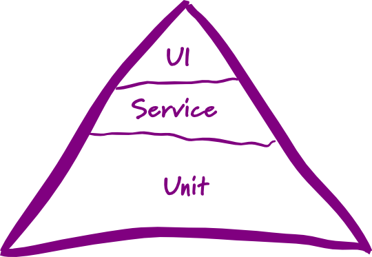

# Test-driven development (TDD)

## Overview

- a software development process
- 极限编程
- by Kent Beck

## TDD追求的目标：

代码整洁可用（Clean code that works）

## 测试驱动开发的规则

- 只有在测试失败时，我们才写新的代码
- 消除重复

## 这意味着

- 用测试来驱动开发
- 一边写测试一边开发
- 开发环境可以对小改动快速响应
- 为方便测试，代码必须高内聚低耦合

## 步骤

<!-- .slide: data-background="white" -->

## 动机是什么？

TDD是一种可以在开发过程中控制忧虑感的开发方法

### 担忧的负面影响

- 让你犹豫不决
- 不愿意与别人交流
- 羞于面对反馈
- 脾气暴躁

### 我们需要

- 尽快开始动手
- 更多参与沟通与交流
- 主动寻求反馈
- 改掉脾气暴躁（这个还是要靠自己）

Note: 使用TDD让开发分解成一个个相对简单容易的步骤，然后各个击破

# Behavior-driven development (BDD)

- a software development process
- developed by Dan North
- as a response to the issues encountered teaching TDD

- Test method names should be sentences
- A simple sentence template keeps test methods focused
- An expressive test name is helpful when a test fails
- `Behaviour` is a more useful word than `test`
- given-when-then template
 - Given some initial context (the givens)
 - When an event occurs
 - then ensure some outcomes

## 2 levels of TDD

- Acceptance TDD
- Developer TDD

# 测试金字塔

<!-- .slide: data-background="white" -->

Note: UI tests is brittle, expensive to write, and time consuming to run. high-level tests are there as a second line of test defense. If you get a failure in a high level test, not just do you have a bug in your functional code, you also have a missing unit test.

# 参考资料

- [Test Driven Development: By Example](http://www.amazon.com/Test-Driven-Development-By-Example/dp/0321146530)
- [UnitTest](http://martinfowler.com/bliki/UnitTest.html)
- [Introduction to Test Driven Development](http://agiledata.org/essays/tdd.html)
- [Introducing BDD](http://dannorth.net/introducing-bdd/)